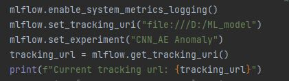
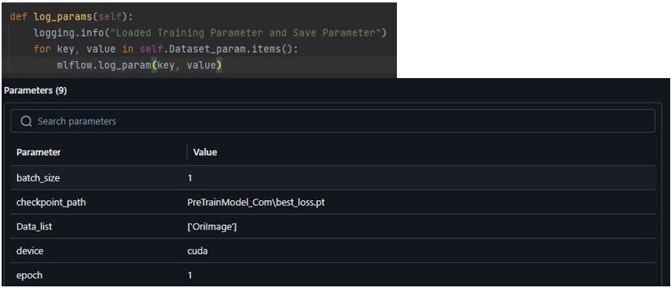
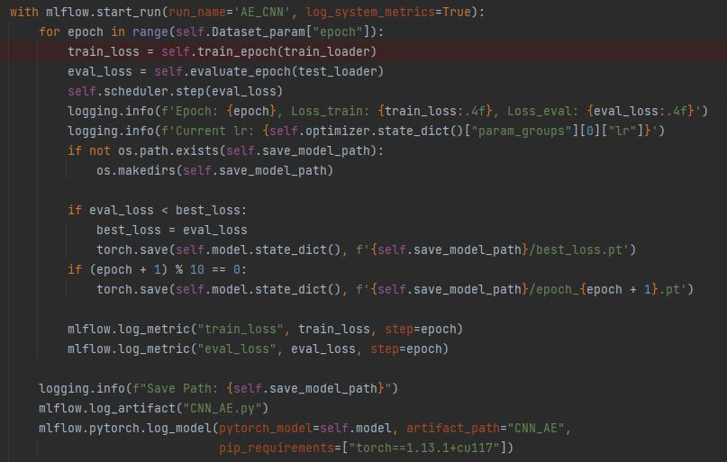
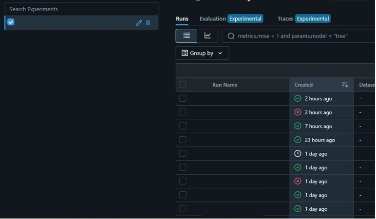

MLflow 是一個開源平台，旨在簡化和加速機器學習項目的管理和部署。它提供了四個主要組件，這些組件可以單獨使用，也可以一起使用，以提供一個統一的端到端機器學習工作流程。以下是這些組件的簡要介紹：

1. **MLflow Tracking**：
   - **用途**：用於記錄和查詢實驗的參數、指標和結果。
   - **特點**：支援多種儲存後端（如文件系統、SQL 資料庫、Amazon S3 等），並提供了一個易於使用的 API 來記錄和檢索實驗結果。
   - **好處**：能夠輕鬆比較不同實驗的性能，追踪模型的訓練過程。

2. **MLflow Projects**：
   - **用途**：用於定義和封裝可重現的機器學習項目。
   - **特點**：使用一個簡單的 YAML 文件來指定項目的依賴項和運行指令，並支援 Docker 和 Conda 來隔離環境。
   - **好處**：確保項目在不同環境中的可重現性，便於分享和部署。

3. **MLflow Models**：
   - **用途**：用於打包機器學習模型，並標準化模型的部署和服務。
   - **特點**：支援多種模型格式（如 TensorFlow、Keras、PyTorch、Scikit-learn 等），並提供了多種部署選項（如 REST API、AWS SageMaker、Azure ML 等）。
   - **好處**：簡化了模型的部署過程，使得模型可以輕鬆地在多種環境中運行。

4. **MLflow Registry**：
   - **用途**：用於管理模型的全生命周期，包括模型的版本控制、階段過渡（如從開發到生產）、註釋和記錄。
   - **特點**：提供了一個集中式的模型存儲庫，可以跟踪和管理模型的版本和元數據。
   - **好處**：便於團隊協作和模型管理，確保模型的可追溯性和可管理性。

# Install

### 安裝 MLflow
```sh
pip install mlflow
```

# Tracking Experiments
1. 設置環境
```python =
import mlflow
# 設置實驗名稱
mlflow.set_experiment("Random Forest Experiment")
```
2. 開始運行紀錄
- **`mlflow.start_run()`是 MLflow 用於開始一個新的運行（run）的函數。每個運行代表一次獨立的實驗，允許你記錄和跟踪該實驗中的所有參數、指標和模型。**
```python =
import mlflow
with mlflow.start_run():
    # 記錄參數和指標
    mlflow.log_param("param_1", param_1)
    mlflow.log_param("param_2", param_2)
    mlflow.log_metric("mse", your_loss_mse)
```
- **`mlflow.start_run()`**
  - **run_id**: 
    - **Type**: `str` 
    - **Describe**: 指定一個已存在的運行 ID 來繼續該運行。如果沒有指定，將創建一個新的運行。
  
  - **experiment_id**: 
    - **Type**: `str` 
    - **Describe**: 指定運行應該歸屬於的實驗 ID。如果沒有指定，將使用當前活動實驗。如果沒有活動實驗，將使用默認實驗。
  
  - **run_name**: 
    - **Type**: `str` 
    - **Describe**: 指定運行的名稱。
  
  - **nested**: 
    - **Type**: `bool` 
    - **Describe**: 指定該運行是否應該是嵌套運行（即是否是在另一個運行內部開始的）。默認為 `False`。
    
3. 記錄模型
- **`mlflow.log_model()`**
```python =
mlflow.pytorch.log_model(pytorch_model=your_model, artifact_path='your_model_name')
```
# Practical Application
- `Setting mlflow` 
    <p float="left">
        
    </p>
  

- `Save Parameters`
    <p float="left">
        
    </p>
  

- `Save Model, .py file and plt loss curve`
    <p float="left">
        
    </p>

# View result
```shell =
mlflow ui --backend-store-uri your_mlflow_url --port your_port
```
<p float="left">
    
</p>